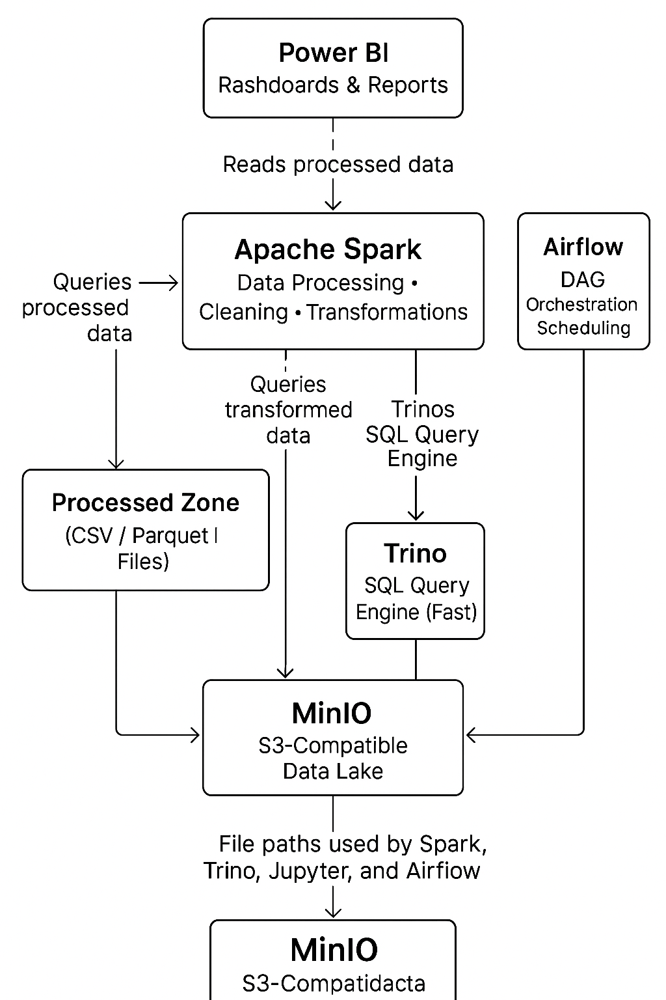

# Local Data Lakehouse

A local, containerized data-engineering environment built using MinIO, Apache Spark, Jupyter, Trino, and Airflow.

---

## Overview

This project provides an end-to-end lakehouse architecture for storing, processing, querying, and visualizing data. It is designed for learning, experimentation, and building small-scale ETL workflows. The system integrates:

* **MinIO** – S3-compatible object storage serving as the data lake.
* **Apache Spark** – distributed compute engine for data transformation.
* **Jupyter Notebook** – an interactive space for PySpark development and analysis.
* **Trino** – SQL query engine for federated and fast data querying.
* **Airflow** – orchestrator for automating ETL pipelines.
* **Power BI** – dashboarding tool for analytics and reporting.

---

## Project Structure

```
Local-Data-Lakehouse/
├── docker-compose.yml                 # All services defined here
├── airflow/                           # Airflow root folder
│   └── dags/                          # DAG definition files
│       ├── lakehouse_dag.py           # Airflow DAG for ETL automation
│       └── __pycache__/               # Python cache generated automatically
├── DATA/                              # Raw and processed datasets
├── minio_data/                        # Backing storage for MinIO buckets
├── src/                               # Jupyter notebooks, ETL scripts, PySpark code
├── Final_Result_Images/               # Example charts or dashboard snapshots
├── PowerBI.py                         # Helper script for Power BI preparation
├── Customer Segment Dashboard.pbix    # Power BI dashboard
├── requirements.txt                   # dependencies
└── README.md                          # Project documentation
```

---

## Working  Data

The `DATA/` directory contains the raw and processed files that move through the ETL workflow.
Current files:

```
DATA/
├── Customers.csv
├── Final Customers.csv
├── POWERBI DATA.csv
└── students.csv
```

### File Details

**Customers.csv**
Raw input file. Contains unprocessed customer information. Used as the starting point for cleaning and transformation.

**Final Customers.csv**
Output from Spark processing. This file contains cleaned, standardized, enriched customer data ready for analytics or SQL querying.

**POWERBI DATA.csv**
Dataset prepared specifically for Power BI. Typically includes aggregated metrics, summary tables, or optimized columns for dashboard performance.

**students.csv**
Additional dataset used for testing, practice transformations, or validation of ETL logic.

### How These Files Flow Through the Pipeline

1. Raw files (Customers.csv, students.csv) are placed in MinIO.
2. Spark reads the raw data, cleans it, and writes transformed outputs (Final Customers.csv or Parquet).
3. Airflow automates these steps through `lakehouse_dag.py`.
4. Trino queries the cleaned/processed data using SQL.
5. Power BI loads `POWERBI DATA.csv` or Parquet outputs to build dashboards.

---

## Getting Started

### 1. Clone the repository

```bash
git clone https://github.com/Pankaj7079/Local-Data-Lakehouse.git
cd Local-Data-Lakehouse
```

### 2. Start all services

```bash
docker-compose up -d
```

### 3. Check that all containers are running

```bash
docker ps
```

---

## Accessing the Services

### Jupyter Notebook

* URL: `http://localhost:8888`
* Find token:

  ```bash
  docker logs jupyter
  ```

### MinIO

* URL: `http://localhost:9001`
* Default credentials:

  * Username: `minioadmin`
  * Password: `minioadmin`

### Spark Web UI

* URL: `http://localhost:8080`

### Trino

* URL: `http://localhost:8081`

### Airflow

* URL: `http://localhost:8082`
* Login: `airflow / airflow`

### Power BI

Open the `.pbix` file and connect it to the processed datasets generated by Spark.

---

## Lakehouse Workflow

1. **Upload raw files** into MinIO.
2. **Process data with PySpark** using Jupyter notebooks or Spark scripts.
3. **Automate ETL** with Airflow using the `lakehouse_dag.py` DAG.
4. **Query the transformed data** through Trino using SQL.
5. **Build dashboards** in Power BI using cleaned and enriched datasets.
6. **Iterate and extend** with new datasets or additional transformations.

---

## Future Enhancements

* Delta Lake or Apache Iceberg for transactional lakehouse capabilities
* Superset or Looker-style BI layer
* Distributed Spark workers
* Kafka-based streaming ingestion
* Role-based access control and improved security

---
## Final Architecture Flow

Below is the complete architecture of the Local Data Lakehouse:-



